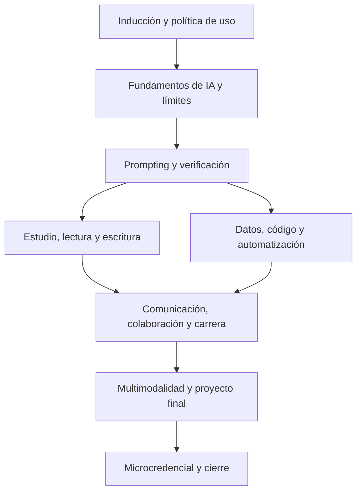

# Vista general del programa

La microcredencial combina alfabetización en IA, productividad académica, ética, privacidad, verificación, análisis de datos, comunicación profesional y proyecto final.

## Módulos

| Módulo | Horas | Foco |
|---|---:|---|
| [Inducción](/docs/04-syllabus-modular/modulo-01-induccion) | 4 | Introduce el propósito de la microcredencial, la política de uso de IA, las reglas de privacidad, la trazabilidad obligatoria y el diagnóstico inicial. |
| [Fundamentos](/docs/04-syllabus-modular/modulo-02-fundamentos-ia) | 6 | Presenta capacidades, límites y riesgos de los sistemas de IA generativa, incluyendo contexto, memoria, sesgos, alucinaciones y seguridad. |
| [Prompting y verificación](/docs/04-syllabus-modular/modulo-03-prompting-y-verificacion) | 10 | Desarrolla solicitudes reproducibles, criterios de evaluación, verificación con fuentes y corrección humana de salidas de IA. |
| [Estudio y escritura](/docs/04-syllabus-modular/modulo-04-estudio-y-escritura) | 8 | Integra IA en lectura, toma de notas, estudio y escritura académica sin perder autoría, voz propia ni rigor de citación. |
| [Datos y código](/docs/04-syllabus-modular/modulo-05-datos-codigo-y-automatizacion) | 10 | Trabaja con CSV, hojas de cálculo, notebooks, scripts simples y asistentes de código para producir análisis reproducibles con licencias claras. |
| [Comunicación y carrera](/docs/04-syllabus-modular/modulo-06-comunicacion-y-carrera) | 8 | Aplica IA a presentaciones, documentación, colaboración, CV, entrevistas y portafolio profesional inicial. |
| [Multimodalidad y proyecto](/docs/04-syllabus-modular/modulo-07-multimodalidad-y-proyecto-final) | 8 | Cierra el programa con un proyecto aplicado por disciplina, evidencias de proceso, producción multimodal responsable y defensa final. |

## Producto final

El programa culmina en un portafolio con evidencias, bitácora de prompts, auditorías de salidas de IA, artefactos académicos o profesionales y proyecto aplicado por disciplina.

